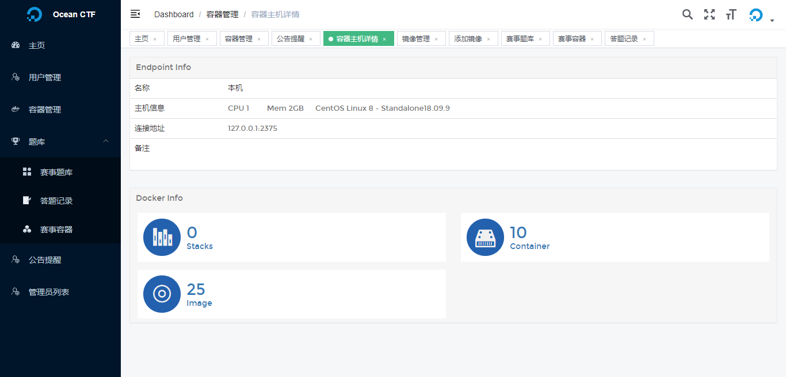
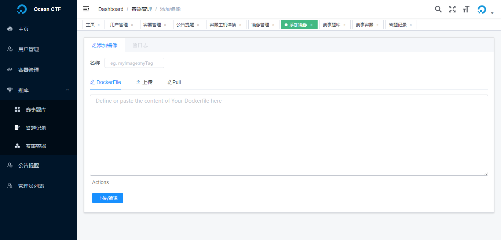
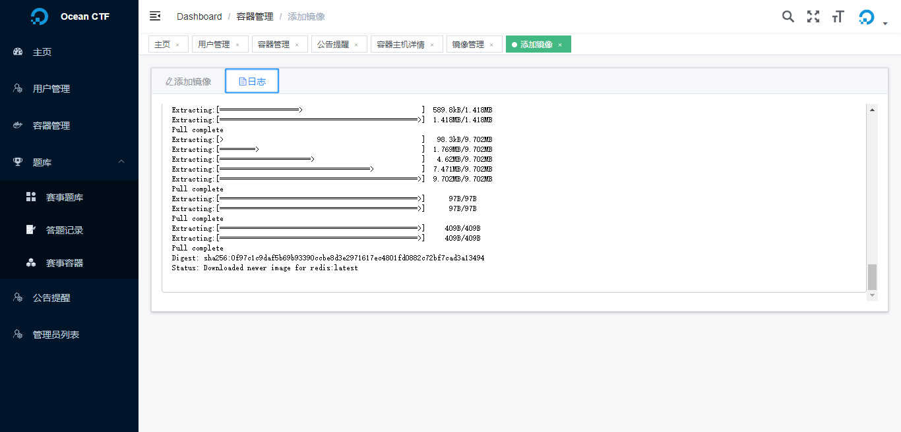
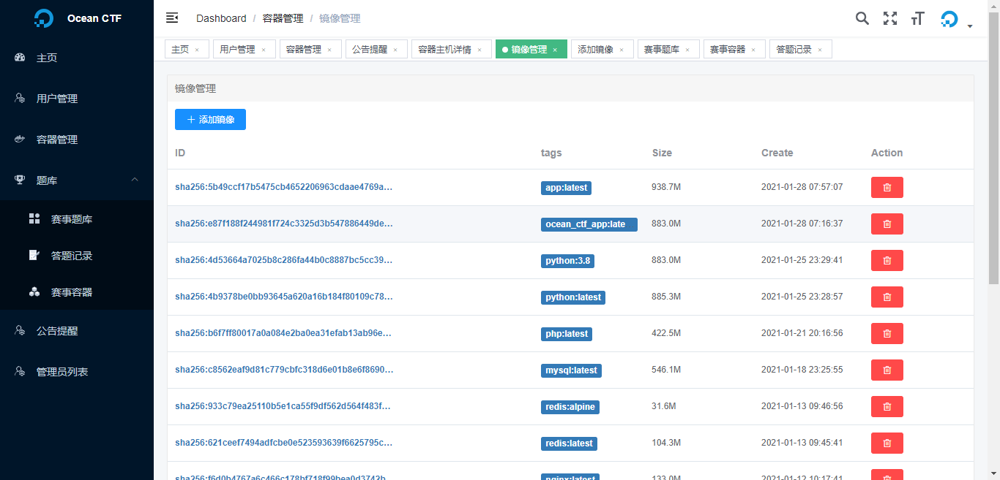
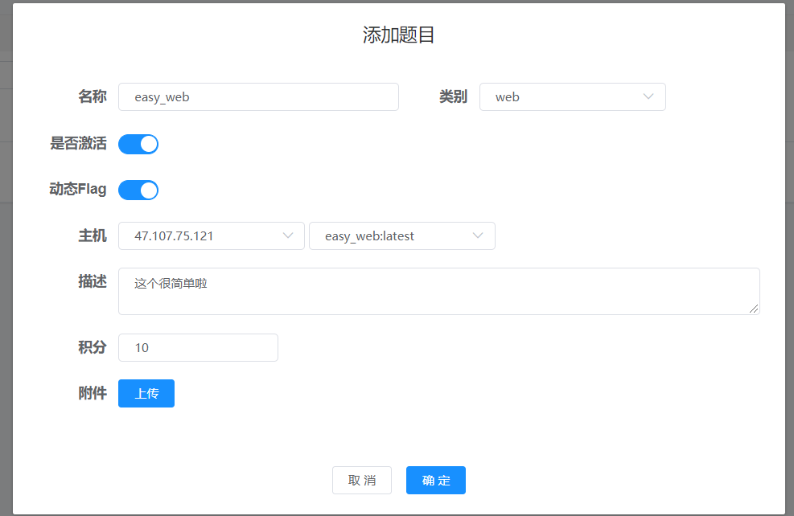
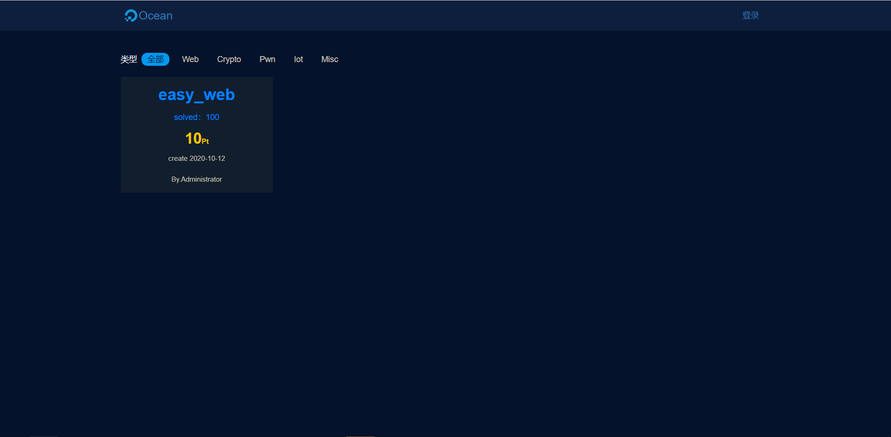
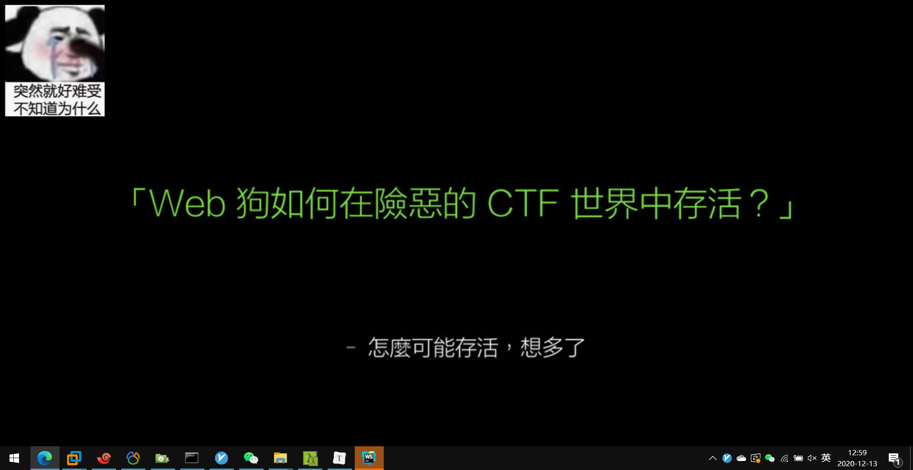

# Ocean CTF
> 一个动态flag练习靶场平台

#### TODO

- [x] 容器管理 
- [x] 题库管理
- [x] 动态flag
- [x] 作弊检测
- [x] 公告通知
- [x] 动态启动题库
- [x] 题库隔离
- [x] 公告通知
- [x] 排行榜
- [x] 快速部署
- [ ] 大屏展示
- [ ] 权限分离
- [ ] fix bug
- [ ] fix bug
- [ ] fix bug


#### Demo地址

线上地址 http://159.75.92.142:8080
管理后台 http://159.75.92.142:8080/manager  访客账号  test/test  

默认超级管理员账号 superuser/admin


#### 环境依赖

```
Python3.6+
mysql5.6+
redis
nginx(可选)

```

##### 下载代码

```
git clone https://github.com/tongchengbin/ocean_ctf.git
```

##### 修改配置文件

```
# vim config/config.py
# mysql/mariadb 配置文件  当然也可以替换其他数据库
DB_CONFIG = {
    "user": 'root',
    "password": '123456',
    "host": '127.0.0.1',
    "port": "3306",
    "db":"ocean"
}
# redis配置
REDIS_CONFIG = {
    "host":'127.0.0.1',
    'password':""
}

```

##### 初始化数据库

```
mysql -uroot -p{password} -e "source install/ocean.sql"
```
##### 安装Python依赖

```
pip install -r requirements.txt
```


##### 快速运行

```shell
chmod +x ./run.sh
./run.sh
```
##### 生产模式配置nginx
> 默认情况下项目已经给管理后台的页面做了静态处理 但是建议使用nginx处理静态文件

```
# vim /etc/nginx/conf.d/ctf.conf
server {
        listen       8080 default_server;
        server_name  _;
        location / {
        proxy_pass http://127.0.0.1:5000;
        }
    location /manager {
        alias /opt/ocean_ctf/install/manager/dist;
    }
    }
```
##### 使用supervisord托管程序
因为celery可能会因为程序异常而退出 所以使用supervisord托管celery 同时也可方便管理，如果使用supervisord托管进程，不要使用run.sh 启动避端口冲突

1. 安装supervisord

   ```shell
   yum install -y supervisord
   ```
3. 配置托管程序

   ```shell
   cp ./install/config/supervisord/ocean.ini /etc/supervisord.d/
   ```
   
2. 设置开机启动

   ```shell
   systemctl enable supervisord.service
   systemctl start supervisord.service
   ```

   

#### Docker容器

##### 安装Docker
```
curl -fsSL https://get.docker.com | bash -s docker --mirror Aliyun

启动
systemctl start docker
查看状态
systemctl status docker

您亦可以使用阿里云镜像加速来获取更好的体验

```

##### 开启 Docker API 2375 端口
```
开启API
vim /usr/lib/systemd/system/docker.service
ExecStart=/usr/bin/dockerd -H fd:// --containerd=/run/containerd/containerd.sock -H tcp://0.0.0.0:2375
systemctl daemon-reload
systemctl restart docker

检查API
curl 127.0.0.1:2375/info
```

#### 常见问题&注意事项

##### python
```
请注意设置python3为默认python版本
```

##### pip 报错mysqlclinet
```
centos: sudo yum install mysql-devel
ubuntu: sudo apt-get install libmysqlclient-dev

```

##### Docker
```
动态Flag需要在Dockerfile中写入启动运行脚本，并从文件拷贝至容器用于替换题目中的静态flag 
flag变量为$1
```

#### 其他截图

- 

- 容器主机详情

  ​	

- 编译镜像

  

- 编译进度

  

- 镜像列表

  

- 添加动态题库

  

- 首页

  

* 启动容器

  

- 靶场

   
  
- 管理后台

  

  

  

  

  